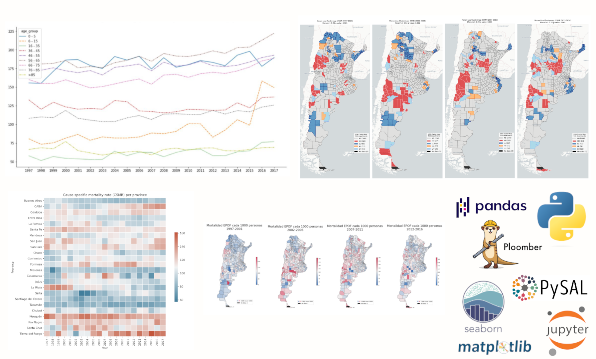
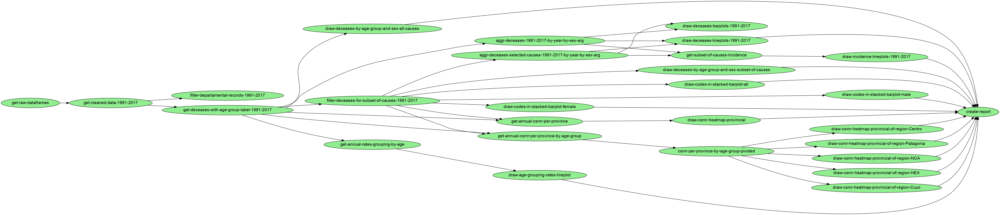

# Generalizable pipeline for epidemiological studies in Argentina (1991-2017) based on specific diseases.

Using ploomber pipelines:

```
> conda activate my-environment
> ./install_packages.sh
> pip install --editable .
> ploomber build
```

## Pipeline:



